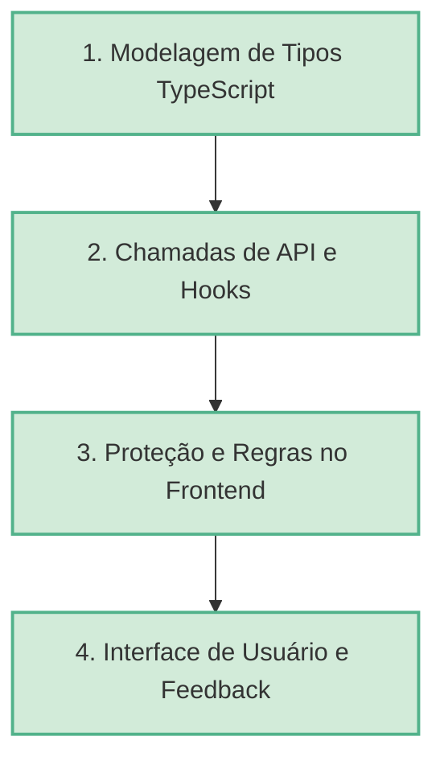

# Guia de Fluxo de Implementação e Boas Práticas

Este documento serve como diretriz obrigatória para todas as futuras implementações de funcionalidades e integrações de API no aplicativo `sigest-mobile`. Ele consolida as decisões de arquitetura e padrões de código aplicados com sucesso nas integrações de Autenticação e Professores.

---

## 1. Passo a Passo do Fluxo de Trabalho

Sempre que uma nova funcionalidade que necessite de integração com o backend for solicitada, o processo deve seguir rigorosamente as 4 etapas abaixo:



---

## 2. Padrões de Código por Camada

### Camada 1: Tipagem (`src/types/<modulo>.ts`)
Todo módulo deve ter seus tipos declarados separadamente em um arquivo dedicado na pasta `src/types/`.
* **Regra 1:** Evitar tipos genéricos como `any` ou `Record<string, any>`.
* **Regra 2:** Modelar separadamente os payloads de envio (`Request`), dados de sucesso (`ResponseSuccess`), respostas vazias (`EmptyResponse`) e erros de validação (`ValidationError`).
* **Regra 3:** Criar tipos união para respostas de rotas que possuem múltiplas assinaturas.

*Exemplo de estrutura ideal:*
```typescript
export interface MeuModelo {
  id: number;
  name: string;
}

export interface MinhaResponseSuccess {
  status: true;
  data: MeuModelo[];
}

export interface MinhaResponseEmpty {
  status: true;
  data: null;
}

export type MinhaApiResponse = MinhaResponseSuccess | MinhaResponseEmpty;
```

---

### Camada 2: API e Cache (`src/api/<modulo>.ts`)
As chamadas diretas de requisição HTTP (via Axios) e os hooks de gerenciamento de cache (via TanStack Query) devem residir na pasta `src/api/` em um arquivo de mesmo nome do módulo.
* **Regra 1:** Nunca prefixar as rotas com `/api` nas chamadas (`api.get('/professors')`), pois a URL base já contém o `/api` configurado no `.env`.
* **Regra 2:** Utilizar `keepPreviousData` para paginação fluida, evitando telas pretas/piscados de carregamento ao trocar de página.
* **Regra 3:** Tratar strings de parâmetros de busca antes do envio (utilizando `encodeURIComponent`).
* **Regra 4:** Caso a rota exija regras estritas (ex: mínimo de 3 caracteres), bloquear a chamada no hook para evitar requisições desnecessárias que retornariam erro `422 Unprocessable Entity`.

*Exemplo de API e Hook:*
```typescript
import { useQuery, keepPreviousData } from "@tanstack/react-query";
import { api } from "../lib/axios";

export async function getDados(page: number) {
  const { data } = await api.get(`/dados`, { params: { page } });
  return data;
}

export function useDadosQuery(page: number) {
  return useQuery({
    queryKey: ["dados", page],
    queryFn: () => getDados(page),
    placeholderData: keepPreviousData,
    staleTime: 1000 * 30, // 30 segundos
  });
}
```

---

### Camada 3: Validação, Erros e Redirecionamentos
As telas devem tratar de forma preventiva e reativa todos os comportamentos de requisição:

1. **Validação Local Obrigatória (Zod + React Hook Form):**
   * Todo novo formulário de cadastro ou edição deve utilizar obrigatoriamente **React Hook Form** e **Zod** para gerenciamento de estados de formulário e validação client-side.
   * Todos os schemas do Zod devem ser declarados em arquivos específicos dentro da pasta `src/schema/`.
   * A nomenclatura dos arquivos de schema deve descrever claramente o que está sendo validado (ex: `src/schema/cadastro-aluno.ts`, `src/schema/cadastro-curso.ts`).
2. **Tratamento de 422 (Validação do Backend):** Mapear as mensagens de erro nos inputs correspondentes.
3. **Tratamento de 401 (Não Autenticado):** O interceptor do Axios (`src/lib/axios.ts`) limpará automaticamente os tokens do `expo-secure-store` e o layout redirecionará o usuário ao login.
4. **Tratamento de 403 (Não Autorizado):** Verificar as `roles` armazenadas globalmente e impedir a renderização ou navegação para a tela exibindo um aviso de restrição.
5. **Tratamento de Lista Vazia (HTTP 200 com `data: null`):** Sempre converter `data: null` para um array vazio `[]` no mapeamento dos dados da tela, garantindo que o componente `ListEmptyComponent` da `FlatList` seja renderizado corretamente.

---

### Camada 4: UI e UX Premium (Skeletons & Feedbacks)
A experiência visual do usuário deve parecer instantânea e fluida.
* **Carregamento Inicial:** Evitar spinners estáticos de carregamento (`ActivityIndicator`) no meio da tela sempre que possível. Em vez disso, utilizar **Skeletons** (telas simuladas com blocos cinzas pulsantes) que correspondam ao formato dos cards reais que serão renderizados.
* **Feedback de Erro:** Exibir erros gerais em banners vermelhos elegantes com bordas arredondadas e texto legível, sem bloquear a navegação com popups irritantes, a menos que seja um caso extremo.
* **Desativação de Elementos:** Enquanto uma requisição estiver em progresso, desativar (`disabled={isLoading}`) todos os botões e inputs para evitar requisições em lote duplicadas.

---

## 5. Regra Obrigatória de Testes

Toda nova implementação, alteração de fluxo, ajuste de rota, mudança de payload ou correção de bug deve vir acompanhada de teste atualizado ou novo teste criado.

### O que deve ser coberto
* **Rotas de API:** validar URL, query params, body e método HTTP.
* **Busca e paginação:** validar quando a busca dispara, quando não dispara e como o loading se comporta durante a troca de página.
* **Cadastro/edição/exclusão:** validar submit, invalidação de cache e atualização da interface.
* **Carregamentos e estados vazios:** validar `isLoading`, `empty state`, erro e bloqueio de inputs/botões.
* **Fluxos críticos:** login, listagens principais e formulários mais usados devem ter cobertura mínima obrigatória.

### Estrutura padrão da pasta de testes
Os testes devem ficar em `__tests__/`, organizados por área e por módulo.

```text
__tests__/
  api/
    aluno/
      getAlunos.test.ts
      createAluno.test.ts
    curso/
      getCourses.test.ts
  screens/
    gerenciar/
      periodoletivo/
        index.test.tsx
      professor/
        cadastro.test.tsx
  components/
    gerenciar/
      periodoletivo/
        periodoletivo-form.test.tsx
  hooks/
    auth/
      useAuth.test.ts
  utils/
    masks.test.ts
  mocks/
    axios.ts
    queryClient.ts
```

### Convenção de nomes
* Arquivos de tela: `index.test.tsx`, `cadastro.test.tsx`, `[id].test.tsx`
* Arquivos de API/hook: `nomeDaFuncao.test.ts`
* Arquivos de componente: `nome-do-componente.test.tsx`
* Arquivos utilitários: `nomeDoHelper.test.ts`

### Regra de manutenção
* Se a feature muda comportamento, o teste correspondente deve mudar junto.
* Se a feature cria um novo fluxo, o teste novo deve nascer junto com ela.
* Mudança de rota, mensagem, loading, validação ou cache sem teste não deve ser considerada finalizada.
---

## 6. Comando Obrigatorio de Validacao

Sempre que criar uma feature, alterar uma rota, ajustar validacao, mexer em loading/cache ou corrigir bug, rode:

```bash
npm run test:all
```

O trabalho so deve ser considerado concluido se esse comando passar sem falhas.
