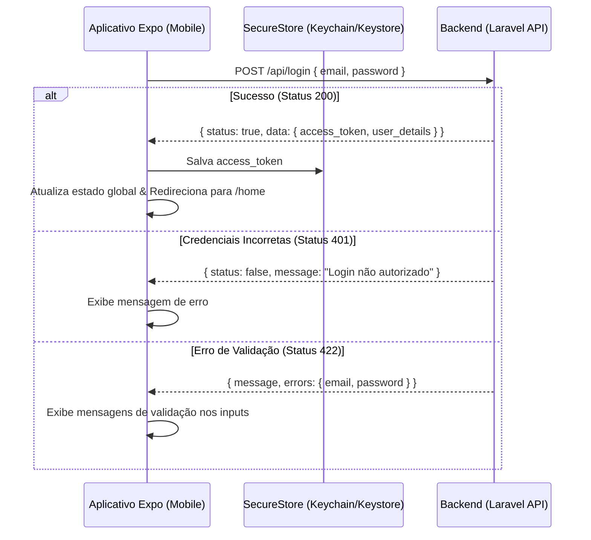

# Documentação do Sistema de Autenticação (Login)

Esta documentação descreve o funcionamento do fluxo de autenticação entre o aplicativo mobile (**Expo Router**) e o backend (**Laravel Sanctum**).

---

## 1. Visão Geral do Fluxo

A autenticação é baseada em **Tokens (Bearer Token)** de uso único gerados pelo Laravel Sanctum. Abaixo está o fluxo passo a passo:



---

## 2. Tipos de Interações (TypeScript)

Conforme solicitado, separamos as definições em tipos estritos para cada interação e caso de resposta da rota. Estes tipos estarão localizados em [auth.ts](file:///c:/Users/joaol/Documents/React%20Native/sigest-mobile/src/types/auth.ts) após aprovação do plano.

### Corpo da Requisição (Request Body)
```typescript
/**
 * Dados necessários para efetuar a tentativa de login.
 */
export interface LoginRequest {
  email: string;
  password?: string; // Opcional no tipo apenas para permitir validações parciais no front
}
```

/**
 * Papéis de usuário disponíveis no sistema.
 */
export type UserRole = "admin" | "servidor" | "professor";

/**
 * Estrutura do usuário retornada após login bem-sucedido.
 */
export interface UserData {
  id: number;
  nome: string;
  email: string;
  access_token: string;
  token_type: string;
  role: UserRole[];
}

### Resposta de Sucesso (Status 200 OK)
```typescript
/**
 * Resposta retornada pelo backend quando as credenciais estão corretas.
 */
export interface LoginResponseSuccess {
  status: true;
  message: string;
  data: UserData;
}
```

### Resposta de Erro de Credenciais (Status 401 Unauthorized)
```typescript
/**
 * Resposta retornada quando o email ou senha são inválidos.
 */
export interface LoginResponseError {
  status: false;
  code: number; // Ex: 401
  message: string;
  data: [null];
}
```

### Resposta de Erro de Validação (Status 422 Unprocessable Entity)
```typescript
/**
 * Erros específicos de campo retornados pelo validador do Laravel.
 */
export interface ValidationErrors {
  email?: string[];
  password?: string[];
  [key: string]: string[] | undefined;
}

/**
 * Resposta retornada quando campos obrigatórios estão ausentes ou inválidos.
 */
export interface LoginResponseValidationError {
  message: string;
  errors: ValidationErrors;
}
```

### Tipo União de Respostas da Rota
```typescript
/**
 * União de todas as respostas possíveis da rota de login.
 */
export type LoginApiResponse = 
  | LoginResponseSuccess
  | LoginResponseError
  | LoginResponseValidationError;
```

---

## 3. Armazenamento Seguro e Sessão Persistente

Para que o usuário não precise digitar suas credenciais toda vez que abrir o aplicativo:

1. **Persistência:** O `access_token` é armazenado localmente usando a API `expo-secure-store` sob a chave `user_token`.
2. **Inicialização:** Sempre que o aplicativo é aberto, o `AuthProvider` lê essa chave do `SecureStore`.
   - Se um token for encontrado, o app assume que o usuário está autenticado e o redireciona automaticamente para o grupo privado `(private)/home`.
   - Se nenhum token for encontrado, ele redireciona para a tela pública `/welcome-screen`.
3. **Revogação:** Quando o usuário clica em "Sair" (`signOut`), limpamos a chave `user_token` do `SecureStore`, limpamos o estado global e o redirecionamos de volta às telas públicas.

---

## 4. Injeção Automática do Token (Axios Interceptor)

Para evitar ter que passar o cabeçalho `Authorization` manualmente em todas as requisições, usaremos um interceptador de requisição do Axios:

```typescript
api.interceptors.request.use(async (config) => {
  const token = await SecureStore.getItemAsync('user_token');
  if (token) {
    config.headers.Authorization = `Bearer ${token}`;
  }
  return config;
}, (error) => {
  return Promise.reject(error);
});
```

Caso alguma requisição retorne `401 Unauthorized` posteriormente (indicando que o token foi revogado no backend ou expirou), um interceptador de resposta irá capturar o erro, acionar o `signOut` e limpar os dados locais.
